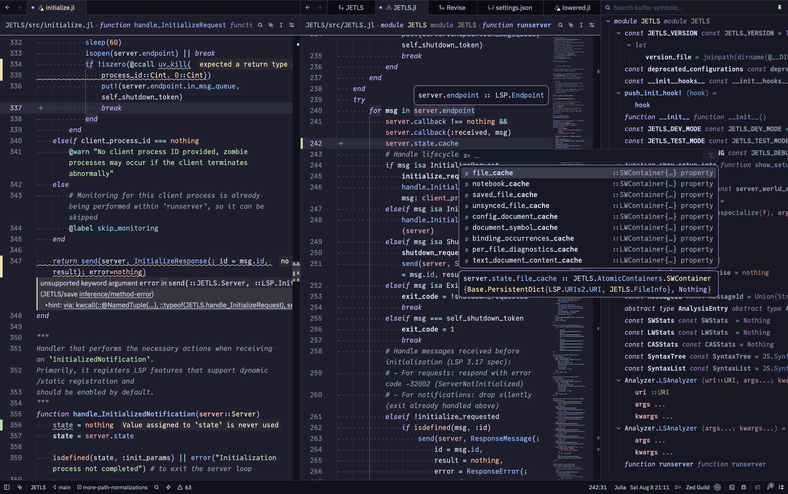

# Zed Julia

This extension adds [Julia](https://julialang.org/) support to
[Zed](https://zed.dev/), powered by the
[JETLS](https://github.com/aviatesk/JETLS.jl) language server.



## Quick links

- [Installation](#installation)
- [Julia executable](#julia-executable)
- [Language server](#language-server)
- [Built-in tasks](#built-in-tasks)
- [Running code in the REPL](#running-code-in-the-repl)
- [Plot side pane](#plot-side-pane)
- [Using Zed from the Julia REPL](#using-zed-from-the-julia-repl)
- [Customizing syntax highlighting](#customizing-syntax-highlighting)
- [Contributing](./CONTRIBUTING.md)

## Installation

1. Install the latest version of [Zed](https://zed.dev/download) for your
   platform.
2. Start Zed.
3. Inside Zed, go to the extensions view by executing the `zed: extensions`
   command (or click Zed->Extensions).
4. In the extensions view, simply search for the term `julia` in the search
   box, then select the extension named `Julia` and click the install button.

## Julia executable

By default, [JETLS](#language-server) and the
[built-in Julia tasks](#built-in-tasks) resolve `julia` from the worktree
environment's `PATH`. No configuration is required if the desired Julia
executable is already available there.

To select Julia per project, use an approved [direnv](https://direnv.net) file:

- If you use [juliaup](https://github.com/JuliaLang/juliaup), select the
  Julia channel by setting `JULIAUP_CHANNEL`:

  > `.envrc` (project root)

  ```sh
  export JULIAUP_CHANNEL=1.13
  ```

  This takes effect when `julia` on the worktree `PATH` resolves to the
  juliaup launcher.

- To put a specific Julia installation on `PATH`:

  > `.envrc` (project root)

  ```sh
  JULIA_HOME="/path/to/julia"
  PATH_add "$JULIA_HOME/bin"
  ```

Run `direnv allow` after creating or modifying the file. This changes the Julia
executable used by both JETLS and the built-in tasks.

> [!warning]
>
> Zed loads the worktree environment once per session, so `.envrc` changes
> (including `direnv allow`) do not affect an already-open project — not even
> after a language server restart. Reopen the project to apply them.

To override Julia only for JETLS, see [Julia for JETLS](#julia-for-jetls);
unlike `.envrc` edits, those settings apply with an automatic server restart.

## Language server

> [!important]
>
> Version 0.2 is a breaking migration from
> [LanguageServer.jl](https://github.com/julia-vscode/LanguageServer.jl) to
> JETLS. See [Migrating to version 0.2](#migrating-to-version-02) for the new
> requirements and configuration changes.

> [!warning]
>
> JETLS is a new language server and still experimental. Notably, it currently
> has a known memory leak issue where memory usage grows with each re-analysis
> (see the [announcement](https://aviatesk.github.io/JETLS.jl/release/CHANGELOG/#Announcement)
> for details and a workaround). If the language server causes problems, you
> can [disable it](#disabling-the-language-server) and keep using the rest of
> the extension.

### Julia for JETLS

JETLS requires [Julia](https://julialang.org/downloads) v1.12.2 through 1.13.x.
To override only the Julia runtime used by managed JETLS without changing
the worktree `PATH`, set `binary.env` in Zed settings. Unlike the
[direnv method](#julia-executable), these overrides apply only to JETLS,
not to the built-in tasks, and changing them restarts the server
automatically:

- If you use [juliaup](https://github.com/JuliaLang/juliaup), select the
  Julia channel by setting `JULIAUP_CHANNEL`:

  > `~/.config/zed/settings.json` (global) or `.zed/settings.json` (per-project)

  ```jsonc
  {
    "lsp": {
      "JETLS": {
        "binary": {
          "env": {
            "JULIAUP_CHANNEL": "1.13",
          },
        },
      },
    },
  }
  ```

  This takes effect when `julia` on the worktree `PATH` resolves to the
  juliaup launcher.

- To specify a Julia executable directly, set the standard Pkg app runtime
  override `JULIA_APPS_JULIA_CMD`:

  > `~/.config/zed/settings.json` (global) or `.zed/settings.json` (per-project)

  ```jsonc
  {
    "lsp": {
      "JETLS": {
        "binary": {
          "env": {
            "JULIA_APPS_JULIA_CMD": "/path/to/specific/julia/executable",
          },
        },
      },
    },
  }
  ```

  The command must be the Julia executable itself (on Windows, `julia.exe`
  rather than a `.bat`/`.cmd` wrapper), since the extension spawns it
  directly; `JULIAUP_CHANNEL` is ignored in this case.

The selected Julia executable is used to
[install and update JETLS](#automatic-installation-and-updates), verify the
installation, and [launch the server](#launch-configuration).

Each executable and Julia minor version (e.g. 1.12 vs 1.13) combination uses a
separate managed depot, so worktrees can select different Julia installations
without repeatedly reinstalling JETLS, and Julia patch releases reuse the
existing depot.

### Automatic installation and updates

Using the selected Julia executable, the extension automatically installs a
pinned JETLS release as a [Julia Pkg app](https://pkgdocs.julialang.org/dev/apps/)
the first time it is needed. Network access is required when JETLS is installed
or updated.

JETLS is installed into a depot private to the extension, so this does not
create or modify a user-global `~/.julia/bin/jetls`. Each zed-julia release
pins an exact JETLS release. When that pin changes, Zed's normal extension
auto-update causes the managed JETLS installation to update as well. Once the
pinned release is installed, verifying and launching the managed JETLS
installation does not require network access. JETLS may still access the network
to instantiate a workspace package environment unless
`full_analysis.auto_instantiate` is disabled.

The server launches with the private depot first in `JULIA_DEPOT_PATH` and
the user depot chain (`~/.julia`, or `JULIA_DEPOT_PATH` if set in the shell
or `binary.env`) after it: everything the managed installation writes stays
private, while packages and precompile caches already installed in the user
depots are reused when analyzing workspace dependencies.

The initial installation may take several minutes while Julia installs and
precompiles JETLS.

> [!tip]
>
> The managed depots live in the `jetls-depots` directory inside Zed's work
> directory for this extension (on macOS, for example,
> `~/Library/Application Support/Zed/extensions/work/julia/jetls-depots`).
> Updates install into a fresh directory and are published atomically, so a
> failed or interrupted update never breaks the installation in use.
> Superseded installations, and installations for a Julia you stopped using,
> are cleaned up automatically after a retention period. It is always safe to
> delete `jetls-depots` or anything inside it to reclaim disk space: the
> pinned JETLS release is reinstalled automatically the next time the
> language server starts.

### Launch configuration

Most users do not need any launch configuration. When the defaults do not
fit your setup, customize how the server is launched in the `lsp.JETLS`
section of Zed settings.

#### Managed JETLS arguments

When `binary.path` is omitted, the extension launches the managed JETLS
installation as:

```sh
julia --startup-file=no --history-file=no --threads=auto -m JETLS serve
```

Custom `binary.arguments` replace the default `["serve"]`: arguments before
a `--` separator are passed to `julia` itself (after the defaults above, so
they can override them), and the rest are passed to JETLS. The arguments
must include exactly one
[`serve`](https://aviatesk.github.io/JETLS.jl/release/launching/) subcommand
of JETLS. For example, to run the server on a single thread:

> `~/.config/zed/settings.json` (global) or `.zed/settings.json` (per-project)

```jsonc
{
  "lsp": {
    "JETLS": {
      "binary": {
        "arguments": ["--threads=1", "--", "serve"],
      },
    },
  },
}
```

`binary.arguments` can be combined with the
[`binary.env` runtime overrides](#julia-for-jetls) to pair custom arguments
with a specific Julia channel or executable.

#### Custom JETLS command

Set `binary.path` to a command that starts a compatible language server over
standard input and output.

Zed accepts absolute paths, `~`-relative paths, worktree-relative executables
such as `tools/start-jetls`, and bare commands such as `julia`.
Worktree-relative paths are resolved against the worktree root; bare commands
that are not worktree entries are resolved through the worktree `PATH`.
Scripts must be directly executable; otherwise, set `binary.path` to their
interpreter and include the script path in `binary.arguments`.

> [!note]
>
> Setting `binary.path` bypasses the extension's managed installation and
> version preflight. Install custom commands yourself, and complete any required
> compilation before starting the language server to avoid the LSP
> initialization timeout.

- To use a JETLS binary you manage yourself, such as a user-global
  `~/.julia/bin/jetls` installed with
  [`Pkg.Apps`](https://pkgdocs.julialang.org/dev/apps/):

  > `~/.config/zed/settings.json` (global) or `.zed/settings.json` (per-project)

  ```jsonc
  {
    "lsp": {
      "JETLS": {
        "binary": {
          "path": "~/.julia/bin/jetls",
          "arguments": ["serve"],
        },
      },
    },
  }
  ```

- To develop JETLS from a local checkout, launch it with Julia directly:

  > `~/.config/zed/settings.json` (global) or `.zed/settings.json` (per-project)

  ```jsonc
  {
    "lsp": {
      "JETLS": {
        "binary": {
          "path": "julia",
          "arguments": [
            "--startup-file=no",
            "--history-file=no",
            "--threads=auto",
            "--project=/path/to/JETLS/directory",
            "-m",
            "JETLS",
            "serve",
          ],
        },
      },
    },
  }
  ```

### Server configuration

JETLS has dynamic configuration, which can change throughout the server's
lifetime, and static initialization options, which are set once at server
startup.
Both can be set in a project-local `.JETLSConfig.toml` or in Zed settings.
Dynamic configuration changes are applied to the running server automatically
with either method, while changes to initialization options require restarting
the language server.

#### Method 1: Project-specific configuration file

This method uses JETLS's native
[`.JETLSConfig.toml` configuration file](https://aviatesk.github.io/JETLS.jl/release/configuration/#config/file-based-config)
and is therefore editor-agnostic: the same file configures JETLS in any editor,
as well as its CLI (e.g. `jetls check`). Create a configuration file, e.g.:

> `.JETLSConfig.toml` (project root)

```toml
# Use JuliaFormatter instead of Runic
formatter = "JuliaFormatter"

# Prevent JETLS from automatically instantiating the package environment
[full_analysis]
auto_instantiate = false

# Suppress unused argument warnings
[[diagnostic.patterns]]
pattern = "lowering/unused-argument"
match_by = "code"
match_type = "literal"
severity = "off"

# Reuse Julia's native inference cache for faster full analysis
[initialization_options]
reuse_native_inference = true
```

#### Method 2: Zed settings

This method uses JETLS's
[LSP-based configuration](https://aviatesk.github.io/JETLS.jl/release/configuration/#config/lsp-config)
mechanism, which Zed supports natively: when you change `initialization_options`
and save `settings.json`, Zed automatically restarts the server to apply them.
Configure initialization options and server settings under the `lsp.JETLS`
section:

> `~/.config/zed/settings.json` (global) or `.zed/settings.json` (per-project)

```jsonc
{
  "lsp": {
    "JETLS": {
      "settings": {
        // Prevent JETLS from automatically instantiating the package
        // environment
        "full_analysis": {
          "auto_instantiate": false,
        },
        // Use JuliaFormatter instead of Runic
        "formatter": "JuliaFormatter",
        // Suppress unused argument warnings
        "diagnostic": {
          "patterns": [
            {
              "pattern": "lowering/unused-argument",
              "match_by": "code",
              "match_type": "literal",
              "severity": "off",
            },
          ],
        },
      },
      "initialization_options": {
        // Reuse Julia's native inference cache for faster full analysis
        "reuse_native_inference": true,
      },
    },
  },
}
```

> [!note]
>
> `.JETLSConfig.toml` takes precedence over editor settings when both are
> present.

For complete configuration details, see the JETLS documentation for
[configuration](https://aviatesk.github.io/JETLS.jl/release/configuration/) and
[initialization options](https://aviatesk.github.io/JETLS.jl/release/launching/#init-options).

### Formatting

JETLS delegates formatting to an external formatter executable. Install the
formatter you want to use as a Julia Pkg app and ensure that its executable is
available on `PATH`. Julia Pkg apps are normally installed into `~/.julia/bin`.

#### Runic

[Runic](https://github.com/fredrikekre/Runic.jl) is the default formatter:

```sh
julia -e 'using Pkg; Pkg.Apps.add("Runic")'
```

JETLS invokes the `runic` executable for document and range formatting.

#### JuliaFormatter

To use [JuliaFormatter](https://github.com/domluna/JuliaFormatter.jl) instead,
install its `jlfmt` executable:

```sh
julia -e 'using Pkg; Pkg.Apps.add("JuliaFormatter")'
```

Then set `formatter = "JuliaFormatter"` using either configuration method
above. Range formatting requires JuliaFormatter v2.7.0 or later.

For custom formatter executables and further details, see the JETLS
[formatter documentation](https://aviatesk.github.io/JETLS.jl/release/formatting/).

### Disabling the language server

If JETLS causes problems, you can disable it while keeping the rest of the
extension working: syntax highlighting, [built-in tasks](#built-in-tasks),
[REPL integration](#running-code-in-the-repl), and so on. Add the following
setting:

> `~/.config/zed/settings.json` (global) or `.zed/settings.json` (per-project)

```jsonc
{
  "languages": {
    "Julia": {
      "enable_language_server": false,
    },
  },
}
```

Remove the setting to re-enable JETLS.

### Migrating to version 0.2

Zed Julia extension v0.2 replaces the
[LanguageServer.jl](https://github.com/julia-vscode/LanguageServer.jl) backend
with [JETLS.jl](https://github.com/aviatesk/JETLS.jl).
This is a breaking migration for existing users:

- JETLS requires Julia v1.12.2 through 1.13.x. See
  [Julia for JETLS](#julia-for-jetls) for runtime selection.
- The language-server identifier has changed from `julia` to `JETLS`. Existing
  LanguageServer.jl settings under `lsp.julia` are not migrated or forwarded to
  JETLS; configure the new server under `lsp.JETLS`.
- The extension now [installs and updates](#automatic-installation-and-updates)
  a pinned JETLS Julia Pkg app in an extension-private depot. The
  LanguageServer.jl environment previously used by the extension is no longer
  used.
- JETLS uses Runic as its default formatter. See [Formatting](#formatting) for
  installation instructions and the JuliaFormatter alternative.

If JETLS is not suitable for your current setup, you can
[disable the language server](#disabling-the-language-server) while continuing
to use syntax highlighting, built-in tasks, and the other extension features.

## Built-in tasks

The extension provides the following built-in tasks:

| Task                        | Operation           |
| --------------------------- | ------------------- |
| `Julia: Pkg.jl instantiate` | `Pkg.instantiate()` |
| `Julia: Pkg.jl precompile`  | `Pkg.precompile()`  |
| `Julia: Pkg.jl update`      | `Pkg.update()`      |
| `Julia: Pkg.jl resolve`     | `Pkg.resolve()`     |
| `Julia: Pkg.jl test`        | `Pkg.test()`        |

Open the command palette, run `task: spawn` (<kbd>Cmd+Shift+R</kbd> on macOS
or <kbd>Alt+Shift+T</kbd> on Linux and Windows), and select a task. Each task
uses the [`julia` command from the worktree environment](#julia-executable)
and activates the project at `ZED_WORKTREE_ROOT`.
Note that the Pkg.jl operations may modify the project environment.
The task terminal is hidden automatically when the command succeeds.

## Running code in the REPL

This section describes how to select Julia code in the editor and run it in
Zed's integrated terminal. This is more of a workaround than a full
integration. Currently, there is no _inline code execution_ as in VSCode. On
the other hand, the language server is not required to make this work.

1. Open a `.jl` file in the editor.

2. From the command palette, run `open in terminal`. This opens a new
   terminal in the worktree root (where the `Project.toml` lives). You can
   also right-click in the editor and use the context menu or press
   ``ctrl-shift-` `` as defined in the JSON example below.

3. In the terminal, start the REPL with `julia --project`.

4. Now it's time to select some code in the editor, copy it to the
   clipboard, paste it into the terminal, execute it, and go back to the
   editor. To make that less tedious, add one or more of the following key
   bindings. Change the `ctrl-shift-f10/11/12` combinations to your liking.

   Note: interacting with the terminal requires sending keystrokes. In the
   examples, `cmd-v` is used to paste code. Please adjust this binding for
   your operating system.

   > `~/.config/zed/keymap.json` (can be opened via `zed: open keymap file`)

   ```jsonc
   [
     {
       // Set the focus back to the editor without hiding the terminal.
       // This is an auxiliary binding used by other bindings.
       "context": "Terminal",
       "bindings": { "ctrl-shift-`": "terminal_panel::ToggleFocus" },
     },
     {
       "context": "Editor && mode == full",
       "bindings": {
         // Open a new terminal and change to the worktree root directory.
         "ctrl-shift-`": "workspace::OpenInTerminal",

         // Execute the whole line the cursor is on and move the cursor to
         // the next line. Invoke this binding repeatedly to run line by
         // line.
         "ctrl-shift-f10": [
           "action::Sequence",
           [
             "editor::SelectLine",
             "editor::Copy",
             "editor::MoveRight",
             ["workspace::SendKeystrokes", "ctrl-` cmd-v ctrl-shift-`"],
           ],
         ],

         // Execute the enclosing top level block e.g., a function
         // definition. Note the additional keystroke "enter" to actually
         // execute the code.
         "ctrl-shift-f11": [
           "action::Sequence",
           [
             "editor::SelectEnclosingSymbol",
             "editor::CopyAndTrim",
             ["workspace::SendKeystrokes", "ctrl-` cmd-v enter ctrl-shift-`"],
           ],
         ],

         // Execute the paragraph (a block surrounded by blank lines).
         "ctrl-shift-f12": [
           "action::Sequence",
           [
             "editor::MoveToStartOfParagraph",
             "editor::SelectToEndOfParagraph",
             "editor::Copy",
             ["workspace::SendKeystrokes", "ctrl-` cmd-v ctrl-shift-`"],
           ],
         ],
       },
     },
   ]
   ```

## Plot side pane

For plot support in Zed, we recommend using
[ZedPlotPane.jl](https://github.com/takuizum/ZedPlotPane.jl).

To install it, run the following in your Julia REPL:

```julia
using Pkg
Pkg.add("ZedPlotPane")
```

To enable the plot pane, load `ZedPlotPane` (`using ZedPlotPane`) in your
Julia REPL **before loading `Plots` or any other plotting package**.

The first plot will create and open `~/.cache/zed-julia/current-plot.png`.
Drag that tab into a side pane; subsequent plots will update there
automatically.

If you close the plot pane, you can re-open it by running
`ZedPlotPane._open_viewer()` in the REPL.

For more information on how to use it, please refer to the
[ZedPlotPane.jl documentation](https://github.com/takuizum/ZedPlotPane.jl).

## Using Zed from the Julia REPL

Zed is currently not on the list of Julia's predefined editors.
You can register it in your Julia startup file:

> `~/.julia/config/startup.jl`

```julia
atreplinit() do repl
    InteractiveUtils.define_editor("zed") do cmd, path, line, column
        `$cmd $path:$line:$column`
    end
end
```

Set the environment variable `EDITOR` (or `VISUAL` or `JULIA_EDITOR`, whatever
you use) to `zed --wait`. Then, using `InteractiveUtils.edit` etc. will open
the document in Zed.

## Customizing syntax highlighting

You can change the foreground color and text attributes of syntax tokens,
for instance:

> `~/.config/zed/settings.json`

```jsonc
{
  "theme_overrides": {
    "One Dark": {
      "syntax": {
        "comment.doc": {
          "font_style": "italic",
        },
        "function.definition": {
          "color": "#0000AA",
          "font_weight": 700,
        },
      },
    },
  },
}
```

See [Syntax Highlighting and Themes](https://zed.dev/docs/configuring-languages#syntax-highlighting-and-themes)
and [Tree-sitter Queries](https://zed.dev/docs/extensions/languages#tree-sitter-queries)
for further details.

Syntax tokens are called _captures_ in tree-sitter jargon.
The following table lists all captures provided by zed-julia. Some captures have
default values (defined in [Zed's color themes](https://github.com/zed-industries/zed/blob/main/assets/themes/))
and the other captures fall back to one of the defaults.
Depending on your color theme, some captures may be set to the editor's
foreground color or to a very similar one. In this case, try to assign a
different color to improve the contrast.

| Capture                     | Is there a default value?  | Note/Example                                      |
| --------------------------- | -------------------------- | ------------------------------------------------- |
| boolean                     | yes                        |
| comment                     | yes                        | line or block comment                             |
| comment.doc                 | yes                        | docstring                                         |
| constant                    | yes                        |
| constant.builtin            | no, falls back to constant | core julia built-in                               |
| function.builtin            | no, falls back to function | core julia built-in                               |
| function.call               | no, falls back to function | name of the called function                       |
| function.definition         | no, falls back to function | name of the defined function                      |
| function.macro              | no, falls back to function | name of the macro                                 |
| keyword                     | yes                        |
| keyword.conditional         | no, falls back to keyword  | `if`, `else`                                      |
| keyword.conditional.ternary | no, falls back to keyword  | `? :`                                             |
| keyword.exception           | no, falls back to keyword  | `try`, `catch`                                    |
| keyword.function            | no, falls back to keyword  | `function`, `do`, short function definition: `=`  |
| keyword.import              | no, falls back to keyword  | `im/export`, `using`, module definition           |
| keyword.operator            | no, falls back to keyword  | `in`, `isa`, `where`                              |
| keyword.repeat              | no, falls back to keyword  | `for`, `while`                                    |
| keyword.return              | no, falls back to keyword  | `return`                                          |
| keyword.type                | no, falls back to keyword  | struct or type definition                         |
| label                       | yes                        | label name for `@label`, `@goto`                  |
| number                      | yes                        |
| number.float                | no, falls back to number   |
| operator                    | yes                        |
| punctuation.bracket         | yes                        | `()`, `[]`, `{}`                                  |
| punctuation.delimiter       | yes                        | `,`, `;`, `::`                                    |
| punctuation.special         | yes                        | `.`, `...`, string interpolation `$`              |
| string                      | yes                        |
| string.escape               | yes                        | escape sequence                                   |
| string.special              | yes                        | command literal                                   |
| string.special.symbol       | yes                        | quote expression                                  |
| type                        | yes                        |
| type.builtin                | no, falls back to type     | core julia built-in                               |
| type.definition             | no, falls back to type     |
| variable                    | yes                        |
| variable.builtin            | no, falls back to variable | core julia built-in: `begin` and `end` in indices |
| variable.member             | no, falls back to variable | example: in `foo.bar`, the member is `bar`        |
